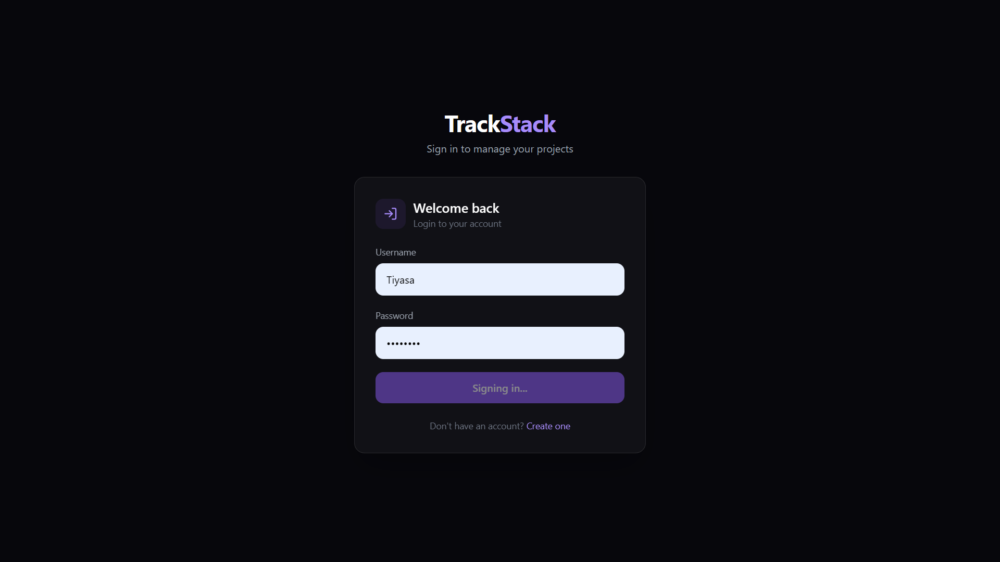
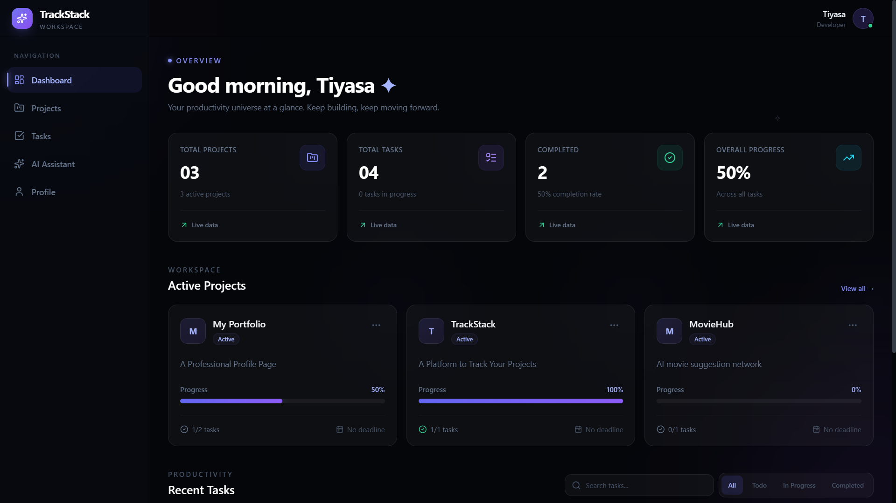
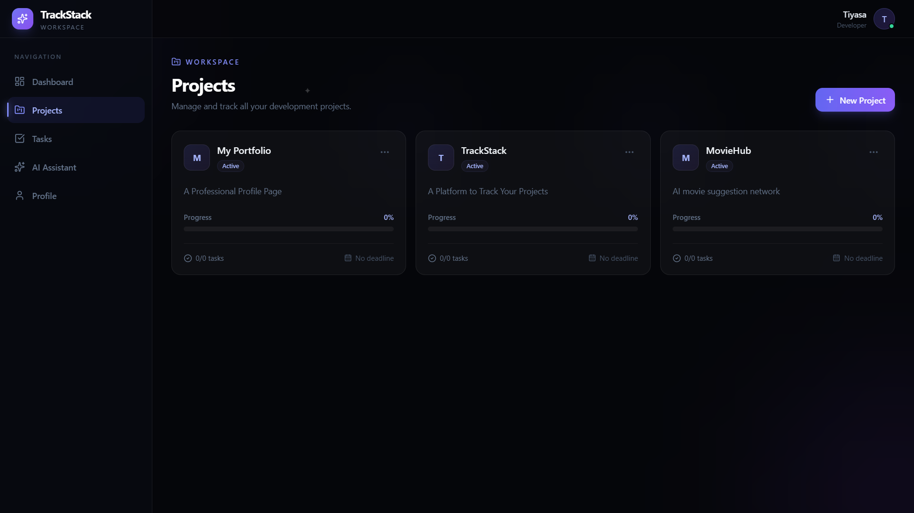
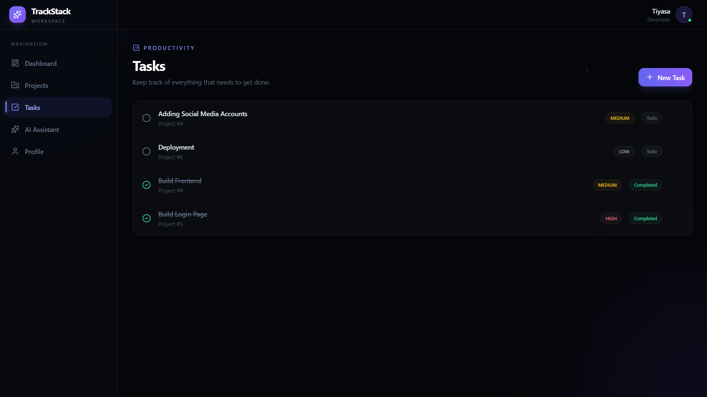
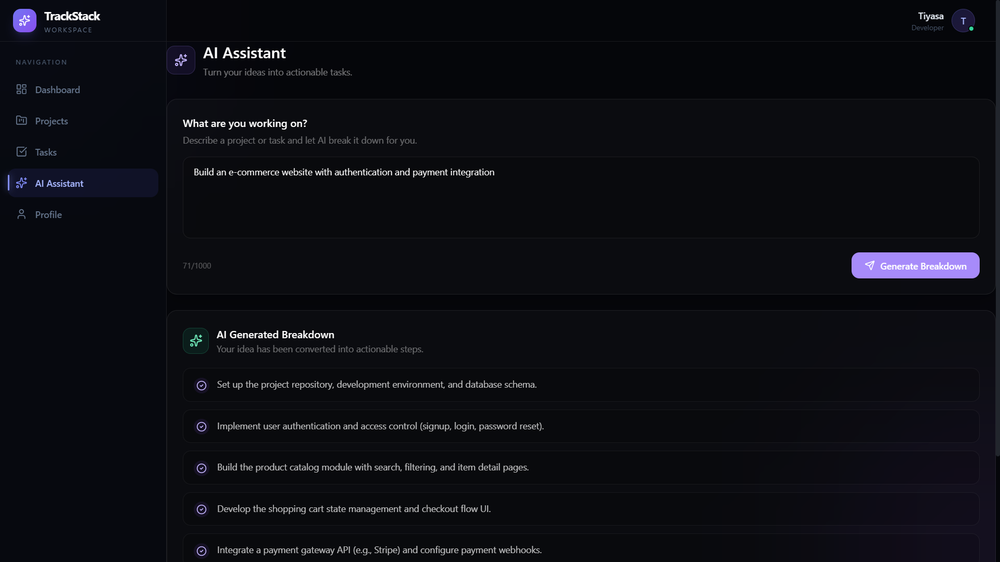
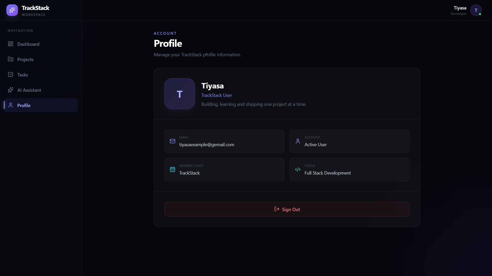

# ✦ TrackStack

> A modern full-stack project and task management platform with AI-powered productivity assistance.

TrackStack is a full-stack project and task management application designed to help users organize projects, manage tasks, monitor progress, and break down complex work into actionable subtasks using AI.

The application combines a premium dark-themed React dashboard with a FastAPI REST API, PostgreSQL database, JWT authentication, and Google's Gemini API.

---

## 🚀 Live Demo

🌐 **Frontend:**  
https://track-stack-nine.vercel.app/

⚙️ **Backend API:**  
https://trackstack-backend-y511.onrender.com/

📚 **Interactive API Documentation:**  
https://trackstack-backend-y511.onrender.com/docs

---

## ✨ Features

### 📊 Dashboard

- Overview of projects and tasks
- Completed task statistics
- Overall task completion progress
- Active project cards
- Recent tasks
- Project-specific progress indicators
- Real-time task status updates
- Project progress calculated from actual database tasks

### 📁 Project Management

- Create projects
- View projects
- Edit projects
- Delete projects
- Project status tracking
- Project progress indicators
- Project-specific task navigation
- User-specific project data

### ✅ Task Management

- Create tasks
- Edit tasks
- Delete tasks
- Task priority
- Task due dates
- Task status management
- Todo / In Progress / Completed states
- Project-specific task filtering
- Persistent task data

### 🤖 AI Task Assistant

TrackStack includes an AI-powered task breakdown feature using Google's Gemini API.

Users can enter a project or task idea, and the AI generates a practical list of actionable subtasks.

**Example input:**

> Build a user authentication system

**Example AI output:**

1. Choose an authentication strategy
2. Set up authentication context
3. Build login and registration forms
4. Connect forms to backend APIs
5. Implement secure token handling
6. Add protected routes
7. Implement logout and session expiration

### 🔐 Authentication

- User registration
- User login
- JWT-based authentication
- Password hashing with bcrypt
- Protected API routes
- Authenticated user profile
- Logout functionality
- User-specific projects and tasks

### 👤 Profile

- Display authenticated user information
- Username and email
- User avatar/initial
- Logout functionality

### 🎨 UI / UX

- Premium dark theme
- Glassmorphism-inspired interface
- Responsive dashboard
- Mobile-friendly navigation
- Interactive cards
- Loading states
- Empty states
- Error handling
- Smooth client-side navigation
- Consistent visual hierarchy

---

# 🛠️ Tech Stack

## Frontend

| Technology | Purpose |
|---|---|
| React | Frontend UI |
| Vite | Development and build tooling |
| React Router | Client-side routing |
| Tailwind CSS | Styling and responsive design |
| Lucide React | Icons |
| Axios | API communication |
| JavaScript | Application logic |

## Backend

| Technology | Purpose |
|---|---|
| FastAPI | REST API framework |
| Python | Backend programming |
| SQLAlchemy | Database ORM |
| Pydantic | Data validation |
| Alembic | Database migrations |
| Uvicorn | ASGI server |
| python-jose | JWT authentication |
| bcrypt | Password hashing |

## Database

| Technology | Purpose |
|---|---|
| PostgreSQL | Relational database |
| Neon | Cloud PostgreSQL hosting |

## AI

| Technology | Purpose |
|---|---|
| Google Gemini API | AI-powered task breakdown |

## Deployment

| Platform | Purpose |
|---|---|
| Vercel | Frontend deployment |
| Render | Backend deployment |
| Neon | Production database |

---

# 🏗️ System Architecture

```text
                         ┌──────────────────────┐
                         │        User          │
                         └──────────┬───────────┘
                                    │
                                    ▼
                         ┌──────────────────────┐
                         │       Vercel         │
                         │   React + Vite UI    │
                         └──────────┬───────────┘
                                    │
                              HTTPS API
                                    │
                                    ▼
                         ┌──────────────────────┐
                         │       Render         │
                         │    FastAPI Backend   │
                         └───────┬──────┬───────┘
                                 │      │
                    ┌────────────┘      └────────────┐
                    ▼                                ▼
          ┌──────────────────┐             ┌──────────────────┐
          │  Neon PostgreSQL │             │   Google Gemini  │
          │     Database     │             │       API        │
          └──────────────────┘             └──────────────────┘
```

---

# 📂 Project Structure

```text
TrackStack/
│
├── frontend/
│   ├── src/
│   │   ├── api/
│   │   │   └── axios.js
│   │   │
│   │   ├── components/
│   │   │   ├── CreateProjectModal.jsx
│   │   │   ├── CreateTaskModal.jsx
│   │   │   ├── EmptyState.jsx
│   │   │   ├── ErrorState.jsx
│   │   │   ├── LoadingState.jsx
│   │   │   ├── Navbar.jsx
│   │   │   ├── ProgressBar.jsx
│   │   │   ├── ProjectCard.jsx
│   │   │   ├── SearchBar.jsx
│   │   │   ├── Sidebar.jsx
│   │   │   ├── StatCard.jsx
│   │   │   └── TaskCard.jsx
│   │   │
│   │   ├── context/
│   │   │   └── AuthContext.jsx
│   │   │
│   │   ├── layouts/
│   │   │   └── DashboardLayout.jsx
│   │   │
│   │   ├── pages/
│   │   │   ├── AI.jsx
│   │   │   ├── Dashboard.jsx
│   │   │   ├── Login.jsx
│   │   │   ├── Profile.jsx
│   │   │   ├── Projects.jsx
│   │   │   ├── Signup.jsx
│   │   │   └── Tasks.jsx
│   │   │
│   │   ├── App.jsx
│   │   ├── index.css
│   │   └── main.jsx
│   │
│   ├── package.json
│   ├── package-lock.json
│   ├── vite.config.js
│   ├── tailwind.config.js
│   └── eslint.config.js
│
├── backend/
│   ├── app/
│   │   ├── routers/
│   │   │   ├── ai.py
│   │   │   ├── auth.py
│   │   │   ├── projects.py
│   │   │   └── tasks.py
│   │   │
│   │   ├── services/
│   │   │   └── ai_service.py
│   │   │
│   │   ├── models/
│   │   │   └── ...
│   │   │
│   │   ├── schemas/
│   │   │   └── ...
│   │   │
│   │   ├── database.py
│   │   ├── security.py
│   │   └── main.py
│   │
│   ├── alembic/
│   ├── alembic.ini
│   ├── requirements.txt
│   └── .env.example
│
├── docs/
│   └── screenshots/
│       ├── login.png
│       ├── dashboard.png
│       ├── projects.png
│       ├── tasks.png
│       ├── ai-assistant.png
│       └── profile.png
│
├── .gitignore
└── README.md
```

---

# 🚀 Getting Started

## Prerequisites

Make sure you have installed:

- Node.js
- npm
- Python 3.11+
- Git
- PostgreSQL/Neon database
- Google Gemini API key

---

# 🔧 Backend Setup

Clone the repository:

```bash
git clone <your-github-repository-url>
cd TrackStack
```

Navigate to the backend:

```bash
cd backend
```

Create a virtual environment.

### Windows

```powershell
python -m venv venv
venv\Scripts\activate
```

### macOS / Linux

```bash
python3 -m venv venv
source venv/bin/activate
```

Install backend dependencies:

```bash
pip install -r requirements.txt
```

---

## 🔐 Backend Environment Variables

Create a file:

```text
backend/.env
```

Add:

```env
DATABASE_URL=your_neon_database_url
SECRET_KEY=your_secret_key
ALGORITHM=HS256
ACCESS_TOKEN_EXPIRE_MINUTES=60
GEMINI_API_KEY=your_gemini_api_key
```

> Never commit your `.env` file or expose API keys, passwords, or database credentials publicly.

Start the backend:

```bash
uvicorn app.main:app --reload
```

The API will be available at:

```text
http://127.0.0.1:8000
```

Interactive API documentation:

```text
http://127.0.0.1:8000/docs
```

---

# 💻 Frontend Setup

Open a new terminal and navigate to the frontend:

```bash
cd TrackStack/frontend
```

Install dependencies:

```bash
npm install
```

Create:

```text
frontend/.env
```

Add:

```env
VITE_API_URL=http://127.0.0.1:8000
```

Start the development server:

```bash
npm run dev
```

The application will be available at the local URL shown in the terminal.

---

# 🔑 Authentication Flow

TrackStack uses JWT-based authentication.

```text
User
 │
 ├── Signup
 │      ↓
 │   FastAPI Backend
 │      ↓
 │   Password hashed with bcrypt
 │      ↓
 │   User stored in PostgreSQL
 │
 └── Login
        ↓
     JWT Token
        ↓
     Stored by frontend
        ↓
     Sent with protected API requests
```

Protected routes verify the JWT before allowing access to user-specific resources.

---

# 🤖 AI Task Breakdown

TrackStack includes an AI-powered task breakdown feature using Google's Gemini API.

The feature is available through:

```text
POST /ai/task-breakdown
```

The frontend sends a project or task description to the FastAPI backend.

The backend sends the description to the Gemini API and returns a generated list of actionable subtasks.

The AI endpoint is protected and requires authentication.

---

# 📡 API Overview

## Authentication

```text
POST /auth/signup
POST /auth/login
GET  /auth/me
```

## Projects

```text
GET    /projects
POST   /projects
GET    /projects/{project_id}
PUT    /projects/{project_id}
DELETE /projects/{project_id}
```

## Tasks

```text
GET    /tasks
POST   /tasks
GET    /tasks/{task_id}
PUT    /tasks/{task_id}
DELETE /tasks/{task_id}
```

## AI

```text
POST /ai/task-breakdown
```

Full interactive API documentation is available here:

https://trackstack-backend-y511.onrender.com/docs

---

# 🗄️ Database

TrackStack uses PostgreSQL with SQLAlchemy.

The main relationships are:

```text
User
 │
 └── Projects
       │
       └── Tasks
```

### User

- ID
- Username
- Email
- Hashed password
- Active status
- Timestamps

### Project

- ID
- Name
- Description
- Status
- Owner

### Task

- ID
- Project
- Title
- Description
- Status
- Priority
- Due date

Alembic is used for database migrations.

---

# 🌐 Deployment

TrackStack is deployed using separate frontend and backend services.

### Frontend

```text
Vercel
↓
React + Vite
```

### Backend

```text
Render
↓
FastAPI
```

### Database

```text
Neon
↓
PostgreSQL
```

### AI

```text
Google Gemini API
```

### Production URLs

**Frontend**

https://track-stack-nine.vercel.app/

**Backend**

https://trackstack-backend-y511.onrender.com/

**API Documentation**

https://trackstack-backend-y511.onrender.com/docs

---

# 📸 Screenshots

## 🔐 Login



---

## 📊 Dashboard



---

## 📁 Projects



---

## ✅ Tasks



---

## 🤖 AI Assistant



---

## 👤 Profile



---

# 🧪 Code Quality

Run ESLint:

```bash
npm run lint
```

Create a production frontend build:

```bash
npm run build
```

The production build is generated inside:

```text
frontend/dist/
```

---

# 🔮 Future Improvements

Potential future improvements include:

- Real-time task updates
- Task notifications and reminders
- Team collaboration
- Role-based access control
- Project analytics
- Activity history
- File attachments
- AI-generated project plans
- AI-powered task prioritization
- Calendar integration
- Email notifications

---

# 👩‍💻 Author

**Tiyasa Mandal**

Built as part of the **Full Stack Development Internship at Innovation Hacks**.

---

## ⭐ Project

If you find TrackStack useful, consider giving the repository a star.